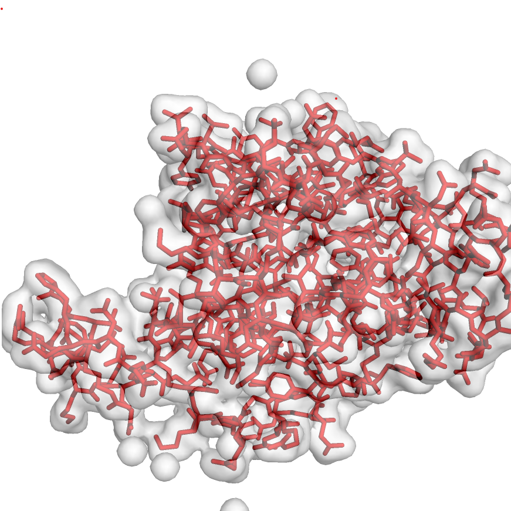

<!-- README.md is generated from README.Rmd. Please edit that file -->

```{r, include = FALSE}
knitr::opts_chunk$set(
  collapse = TRUE,
  comment = "#>",
  fig.path = "man/figures/README-",
  out.width = "100%"
)
```

# pdb3D

<!-- badges: start -->
<!-- badges: end -->

The goal of pdb3D is to visualize the 3D strucutre of protein from Protein Data base. 

## Installation

You can install the released version of pdb3D from [GitHub](https://github.com/) with:

``` r
require("devtools")
devtools::install_github("kevin949373048/pdb3D", build_vignettes = TRUE)
library("pdb3D")
```
## Example

This is a basic example which shows you how to solve a common problem:

```{r example}
library(pdb3D)
## basic example code
```

What is special about using `README.Rmd` instead of just `README.md`? You can include R chunks like so:

```{r cars}
summary(cars)
```

You'll still need to render `README.Rmd` regularly, to keep `README.md` up-to-date.

You can also embed plots, for example:

```{r pressure, echo = FALSE}
plot(pressure)
```

In that case, don't forget to commit and push the resulting figure files, so they display on GitHub!
