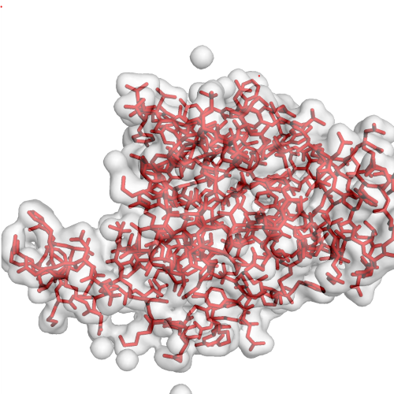
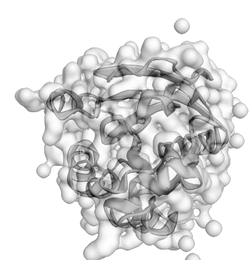
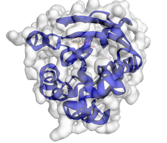

<!-- README.md is generated from README.Rmd. Please edit that file -->

# pdb3D

<!-- badges: start -->

<!-- badges: end -->

The goal of pdb3D is to visualize the 3D strucutre of protein from
Protein Data base and help annote the important structures from database
such as Pfam.

## Installation

You can install the released version of pdb3D from
[GitHub](https://github.com/) with:

``` r
require("devtools")
devtools::install_github("kevin949373048/pdb3D", build_vignettes = TRUE)
library("pdb3D")
```

## Overview

pdb3D contains 3 functions.

For carrying out protein structure visualization: **show3Dmol**,
**changeStyle**.

Pfam structure annotation: **colorPfam**.

To list all functions available in the package:

    ls("package:pdb3D")

    changeStyle("stick", "1a2b", "red")

 Figure 1, show the change
changeStyle function

    show3Dmol("1a2b")

 Figure 2, show the
show3Dmol function display protein structure.

    colorPfam("1a2b")

 Figure 3, show the Pfam
families highlighted in blue in the protein structure.

## Tutorials

For tutorials, refer to the vignette:

    browseVignettes("pdb3D")

## Maintainer

Wenkai Cao (<wenkai.cao@mail.utoronto.ca>).

## Contributions

pdb3D welcomes issues, enhancement requests, and other contributions. To
submit an issue, use the [GitHub
issues](https://github.com/kevin949373048/pdb3D/issues).

## Reference

Nicholas Rego and David Koes 3Dmol.js: molecular visualization with
WebGL *Bioinformatics* (2015) 31 (8): 1322-1324
<doi:10.1093/bioinformatics/btu829>.

Winston Chang, Joe Cheng, JJ Allaire, Yihui Xie and Jonathan McPherson
(2020). shiny: Web Application Framework for R. *R package version
1.5.0*. <https://CRAN.R-project.org/package=shiny>.

Grant, B.J. et al. (2006) *Bioinformatics* 22, 2695–2696.

S. El-Gebali, J. Mistry, A. Bateman, S.R. Eddy, A. Luciani, S.C. Potter,
M. Qureshi, L.J. Richardson, G.A. Salazar, A. Smart, E.L.L. Sonnhammer,
L. Hirsh, L. Paladin, D. Piovesan, S.C.E. Tosatto, R.D. Finn The Pfam
protein families database in 2019 *Nucleic Acids Research* (2019) doi:
10.1093/nar/gky995

## Acknowledgement

This package was developed as part of an assessment for 2020 BCB410H:
Applied Bioinfor-matics, University of Toronto, Toronto, CA
