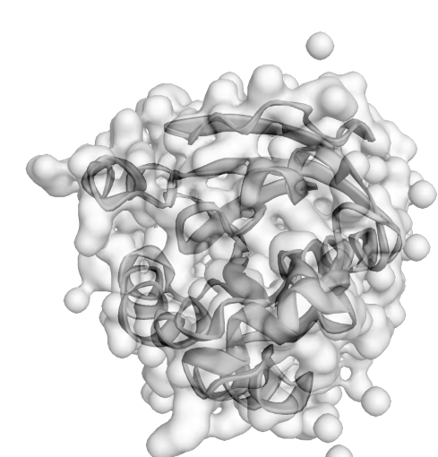
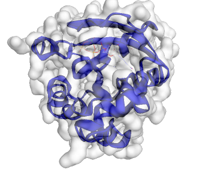

```{r, include = FALSE}
knitr::opts_chunk$set(
  collapse = TRUE,
  comment = "#>"
)
```


## Introduction
 **pdb3D** visualize the 3D strucutre of protein from Protein Data base and help annote the important structures from database such as Pfam.


## Details
 
### __*show3Dmol*__ 
open a 3dmol.js contained shiny app with molecule structure shown 
parameter: **pdbID** protein database id such as "1A2B"
```{}
show3Dmol("1a2b")
```


### __*changeStyle*__ 
 open a 3dmol.js website with different molecule structure styles shown with white surface prediction.
  parameters: **style**: protein structure styles such as cartoon, stick, sphere. cartoon shows structure in loops. sphere shows atoms in sphere. stick shows bonds as sticks. default style is cartoon.

 **pdbID**: protein database id such as "1A2B"

  **color**: color of the structure such as blue, green, yellow, and etc. Users can also use hex color. Default color is grey.
```{}
changeStyle("stick", "1a2b", "red")

```


### __*color_Pfam*__ 
open a 3dmol.js contained shiny app with molecule structure shown and Pfam structure annoted.
parameter: **pdbID** protein database id such as "1A2B"

```{}
colorPfam("1a2b")
```



## References

* Nicholas Rego and David Koes 3Dmol.js: molecular visualization with
WebGL *Bioinformatics* (2015) 31 (8): 1322-1324
<doi:10.1093/bioinformatics/btu829>.

* Winston Chang, Joe Cheng, JJ Allaire, Yihui Xie and Jonathan McPherson
(2020). shiny: Web Application Framework for R. *R package version
1.5.0*. <https://CRAN.R-project.org/package=shiny>.

* Grant, B.J. et al.(2006) *Bioinformatics* 22, 2695–2696.

* S. El-Gebali, J. Mistry, A. Bateman, S.R. Eddy, A. Luciani, S.C. Potter,
M. Qureshi, L.J. Richardson, G.A. Salazar, A. Smart, E.L.L. Sonnhammer,
L. Hirsh, L. Paladin, D. Piovesan, S.C.E. Tosatto, R.D. Finn The Pfam
protein families database in 2019 *Nucleic Acids Research* (2019) doi:
10.1093/nar/gky995


----

```{r}
sessionInfo()
```